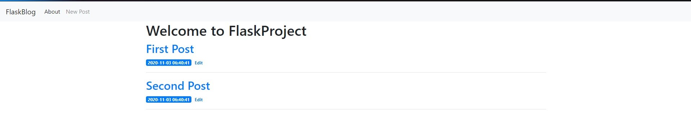

# Flask-Blog-Web-app
A basic web application to practice using Flask Python framework
Made using the tutorial at:
https://www.digitalocean.com/community/tutorials/how-to-make-a-web-application-using-flask-in-python-3

app.py and /templates are where most of the code is

## Images:

View of a post's page (displayed with GET)

  

